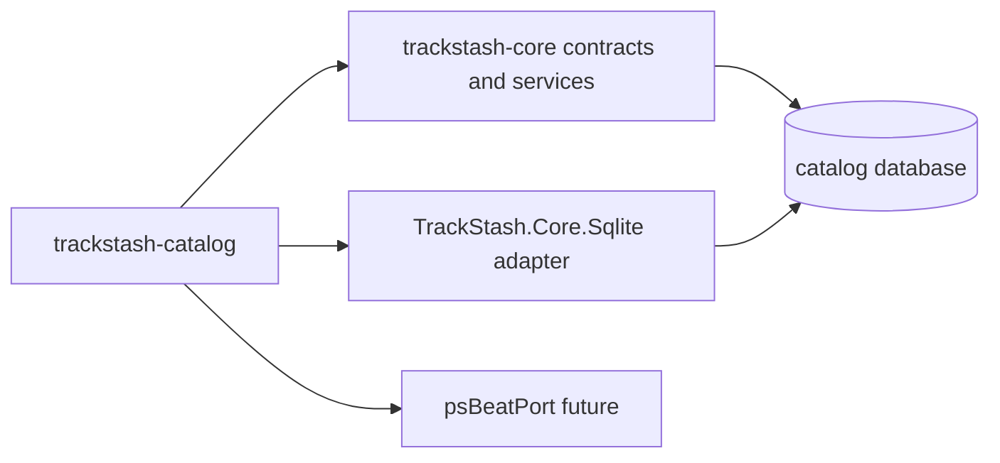

# trackstash-catalog

Canonical catalog and lifecycle operations module for TrackStash.

## Overview

`trackstash-catalog` owns the day-2 catalog workflows that happen after storage has been initialized.
It builds on shared contracts and services from `trackstash-core` and leaves first-run setup to `trackstash-bootstrap`.

This module is the long-term home for:

- canonical catalog ingestion
- catalog-oriented diagnostics
- lifecycle-safe repair and maintenance workflows
- read/query surfaces for other TrackStash modules

## Why This Module Exists

TrackStash needs a boundary between setup concerns and ongoing catalog work.
`trackstash-bootstrap` should remain small and focused on initialization, migrations, and starter orchestration.
`trackstash-catalog` should own the repeated workflows used during normal operation.

Examples:

- importing curated CSV batches into the canonical catalog
- ingesting Beatport or other external source data
- checking referential integrity and catalog health
- repairing derived indexes or denormalized search structures
- exposing catalog summaries to matching, tagging, and organization flows

## How It Fits In The Project

`trackstash-catalog` depends on shared domain contracts and reusable services from `trackstash-core`.
It should not introduce direct knowledge of SQLite internals into command handlers.



Related module docs:

- `../trackstash-core/README.md`
- `../trackstash-core/docs/ecosystem-modules.md`
- `../trackstash-bootstrap/README.md`

## Responsibilities

`trackstash-catalog` should own:

- operational catalog imports and refreshes
- canonical entity maintenance beyond first-run seeding
- catalog diagnostics such as integrity and completeness checks
- repair flows for indexes and derived search structures
- catalog-facing summaries and inspection commands
- reusable application-layer orchestration for future UI or service hosts

`trackstash-catalog` should not own:

- database bootstrap or migration initialization
- raw filesystem scanning
- audio fingerprint generation
- media-file writeback and tag mutation
- low-level repository and provider contract definitions

## Command Surface

Current commands:

- `import-csv`
- `summary`
- `doctor`
- `delete-entity`
- `repair-indexes`

Notes:

- `doctor` currently focuses on readiness and consistency heuristics using provider-agnostic contracts.
- `repair-indexes` currently provides an idempotent maintenance entry point and dry-run reporting; backend-specific rebuild actions can be registered as catalog adds derived index structures.

## Catalog Target Resolution

Catalog commands can now target a logical catalog name instead of requiring a direct database path.

Default behavior:

- selected catalog defaults to `default`
- `--catalog <name>` selects a specific logical catalog
- `--db-path` is still supported as a compatibility override

Examples:

```bash
trackstash-catalog summary --catalog default
trackstash-catalog summary --catalog house --output json
trackstash-catalog import-csv --catalog archive --file ./tracks.csv
```

### Config File Shape

You can define catalog mappings in config (YAML):

```yaml
catalog: default
provider: sqlite
sqlite:
    dbPath: /fallback/default.db

catalogs:
    default:
        provider: sqlite
        sqlite:
            dbPath: /data/trackstash-default.db
    house:
        provider: sqlite
        sqlite:
            dbPath: /data/trackstash-house.db
```

Resolution behavior:

- `catalogs.<name>.provider` overrides top-level `provider`
- `catalogs.<name>.sqlite.dbPath` overrides top-level `sqlite.dbPath`
- if catalog mapping is missing, top-level provider/path are used as fallback

### Environment Variables

Global/default:

- `TRACKSTASH_CATALOG` (selected logical catalog)
- `TRACKSTASH_PROVIDER`
- `TRACKSTASH_SQLITE_DB_PATH`

Per-catalog mapping:

- `TRACKSTASH_CATALOG_<NAME>_PROVIDER`
- `TRACKSTASH_CATALOG_<NAME>_SQLITE_DB_PATH`

Example:

```bash
export TRACKSTASH_CATALOG=house
export TRACKSTASH_CATALOG_HOUSE_PROVIDER=sqlite
export TRACKSTASH_CATALOG_HOUSE_SQLITE_DB_PATH=/data/trackstash-house.db
```

Catalog names in env variables are normalized to lowercase with `_` converted to `-`.

### Precedence

Effective target is resolved in this order:

1. CLI options (`--catalog`, `--provider`, `--db-path`)
2. environment variables
3. config file
4. defaults

## Entity Templates (v1)

`trackstash-catalog` now includes full-schema desired-state YAML templates for canonical entities:

- `templates/entities/label.v1.yaml`
- `templates/entities/artist.v1.yaml`
- `templates/entities/release.v1.yaml`
- `templates/entities/recording.v1.yaml`
- `templates/entities/batch-example.v1.yaml`

These templates are intended to be a common interchange contract for CLI workflows, bash scripts, and PowerShell cmdlets.

See `docs/entity-templates/README.md` for:

- `validate-entity`, `apply-entity --dry-run`, and apply flow
- mode semantics (`replace`, `merge`, `create-only`, `update-only`)
- full-schema field coverage notes and export/import expectations

## Entity Command Usage

The entity-oriented command set is intended to support template generation, validation, export, and desired-state apply workflows.

### `template`

Purpose:

- emit a starter YAML entity template for a requested kind

Usage:

```bash
trackstash-catalog template --kind label
trackstash-catalog template --kind recording --output json
```

### `validate-entity`

Purpose:

- parse and validate YAML entity documents against the v1 contract
- return structured validation issues and exit non-zero on invalid input

Usage:

```bash
trackstash-catalog validate-entity --file ./templates/entities/label.v1.yaml
trackstash-catalog validate-entity --file ./templates/entities/batch-example.v1.yaml --output json
```

### `apply-entity`

Purpose:

- intended to apply desired-state entity YAML into a target catalog

Current status:

- scaffolded command (recognized and argument-validated)
- reconciliation engine is not implemented yet

Usage (scaffold):

```bash
trackstash-catalog apply-entity --catalog default --file ./templates/entities/label.v1.yaml --dry-run
```

### `get-entity`

Purpose:

- intended to retrieve one canonical entity and emit desired-state YAML

Current status:

- scaffolded command (recognized and argument-validated)
- provider-backed retrieval/export mapping is not implemented yet

Usage (scaffold):

```bash
trackstash-catalog get-entity --catalog default --type label --id lbl_example_virelith_records --format yaml
```

Likely later commands:

- `import-beatport`
- `rebuild-embeddings`
- `resolve-aliases`
- `show-entity`
- `find-duplicates`

## Ownership Clarification

Current state:

- `trackstash-bootstrap` may expose compatibility wrappers, while `trackstash-catalog` is the primary operational CLI for catalog workflows.
- `trackstash-core` owns reusable storage contracts and services used by catalog commands.
- delete semantics are implemented in shared storage contracts/services and surfaced through `trackstash-catalog delete-entity`.

Target state:

- `trackstash-catalog` becomes the primary CLI and application boundary for `import-csv` and future catalog imports.
- `trackstash-bootstrap` may keep a compatibility wrapper for first-run convenience, but should not become the long-term home for catalog lifecycle features.

## First Milestones

### Milestone 1: CLI and command host

- create the .NET solution and project layout
- add shared config and output conventions aligned with bootstrap
- wire the SQLite provider through core abstractions

### Milestone 2: Move lifecycle import here

- adopt `TrackStash.Core.Services.CatalogImportService`
- expose `import-csv` as the primary operational command
- preserve `--dry-run`, `--fail-fast`, warning counts, and row-level reporting

### Milestone 3: Catalog health and repair

- implement `summary` for quick catalog counts and readiness
- implement `doctor` for integrity diagnostics
- implement `delete-entity` with dependency-aware safety checks after core delete contracts and rules are finalized
- implement `repair-indexes` for derived index refresh and validation

### Planned delete rules

The first delete feature should be conservative and explicit.

- `label` cannot be deleted while any `release_label_link` rows still point to it
- `artist` cannot be deleted while any `release_artist_credit` or `recording_artist_credit` rows still point to it
- `release` cannot be deleted while any `release_recording` or `release_artist_credit` rows still point to it
- `recording` cannot be deleted while any `release_recording`, `recording_artist_credit`, `recording_relationship`, `media_file_recording_match`, or `media_file_recording_candidate` rows still point to it

Rows that are owned by the entity itself should usually be deleted automatically inside the same transaction rather than treated as blockers.
Examples include external references, aliases, and embedding documents.

### Milestone 4: Source ingestion and enrichment

- add external import surfaces such as Beatport ingestion
- support richer alias, relationship, and provenance maintenance
- prepare read models for matching and tagging modules

## Design Constraints

- depend on `trackstash-core` contracts and services instead of duplicating logic
- keep command handlers thin and orchestration-focused
- prefer idempotent operations wherever feasible
- preserve stable JSON output for automation
- keep failure modes explicit, especially for partial imports and repair flows

## Testing Strategy

The first implementation should mirror the testing style already used in neighboring repos:

- integration tests against temporary SQLite databases
- command-level tests for exit codes and output payloads
- focused tests around idempotency, warning emission, and repair safety

## Progress To Date

Implemented:

- CLI scaffold with shared config resolution and text/json output envelopes
- `import-csv`, `summary`, `doctor`, `delete-entity`, and `repair-indexes` command handlers
- provider-agnostic catalog command orchestration via `IStorageProviderFactory`
- integration coverage for import, summary, delete, and command-level CLI behavior

Still evolving:

- richer `doctor` checks for deeper orphan/relationship diagnostics as shared query contracts grow
- backend-specific `repair-indexes` actions for future derived index materializations
- additional provider registrations beyond sqlite

## Current Status

Status: active implementation with core operational commands in place.

`trackstash-catalog` is scaffolded, tested, and usable for import, summary, doctor diagnostics, delete, and repair entry-point workflows.
Ongoing work is focused on expanding diagnostics depth, repair actions, and additional storage provider support.
