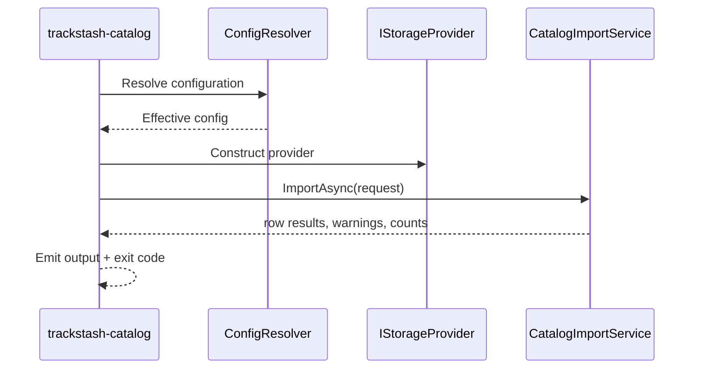
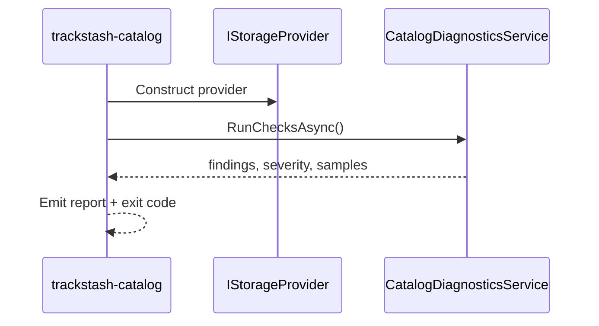
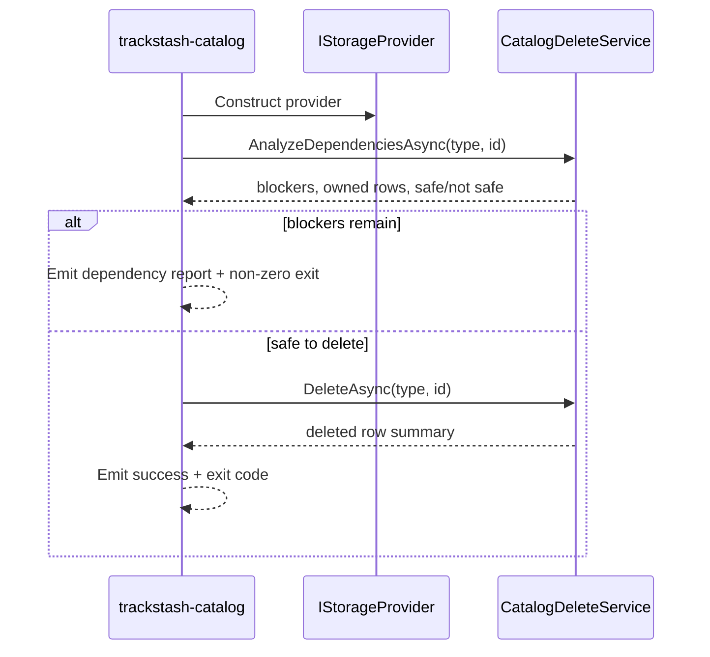

# trackstash-catalog Specification (Draft)

Status: draft
Last updated: 2026-06-20

## 1. Purpose

This document defines the initial implementation direction for `trackstash-catalog`.

`trackstash-catalog` is the operational catalog boundary for TrackStash. It should own recurring catalog workflows after the database has already been initialized.

This includes:

- importing canonical entities into the catalog
- validating catalog integrity and completeness
- repairing derived structures used by search or matching
- exposing catalog summaries and inspection workflows

It should compose:

- storage contracts and reusable services from `trackstash-core`
- concrete storage adapters such as `TrackStash.Core.Sqlite`
- future source clients such as `psBeatPort`

It should not own database bootstrap or low-level storage contracts.

## 2. Scope

In scope for the first delivery phases:

- CLI executable scaffold
- shared configuration and output conventions
- `import-csv` as the primary operational import command
- `summary` for quick catalog counts and readiness checks
- `doctor` for integrity diagnostics
- `delete-entity` for dependency-aware safe deletion
- `repair-indexes` for derived index repair and rebuild workflows
- integration coverage against temporary SQLite databases

Out of scope for the first delivery phases:

- remote service hosting
- UI application surfaces
- full embedding generation pipelines
- advanced interactive review tools
- match scoring and media writeback

## 3. Ownership Boundaries

### 3.1 `trackstash-bootstrap`

Owns:

- initial database creation
- migration execution
- starter seeding and first-run orchestration
- environment readiness checks

Does not own long-term catalog lifecycle workflows.

### 3.2 `trackstash-core`

Owns:

- domain models and repository contracts
- provider abstractions and reusable services
- storage adapters and migration primitives
- normalization and shared catalog orchestration helpers

Current shared catalog service:

- `TrackStash.Core.Services.CatalogImportService`

### 3.3 `trackstash-catalog`

Owns:

- catalog-facing CLI and application orchestration
- lifecycle imports and refresh flows
- integrity diagnostics
- repair and maintenance operations
- read-oriented catalog inspection workflows

## 4. Dependencies and Contracts

`trackstash-catalog` should depend on:

- `TrackStash.Core.Storage.IStorageProvider`
- `TrackStash.Core.Storage.IUnitOfWork`
- `TrackStash.Core.Storage` repository contracts for labels, artists, releases, and recordings
- `TrackStash.Core.Services.CatalogImportService`

Likely future dependencies:

- `psBeatPort` for source ingestion
- additional core services for diagnostics, duplicate detection, or embedding orchestration

Contract source references:

- `../trackstash-core/src/TrackStash.Core/Storage/Contracts.cs`
- `../trackstash-core/src/TrackStash.Core/Storage/Models.cs`
- `../trackstash-core/src/TrackStash.Core/Services/CatalogImportService.cs`

## 5. CLI Contract (Initial Draft)

Executable name (tentative): `trackstash-catalog`

### 5.1 Global Options

- `--provider <name>`
- `--db-path <path>`
- `--config <path>`
- `--output <text|json>`
- `--verbosity <quiet|normal|detailed|debug>`

The CLI should align with `trackstash-bootstrap` where practical so operators do not need to learn two configuration models.

### 5.2 Commands

#### `import-csv`

Purpose:

- import canonical labels, artists, releases, and recordings from a structured CSV

Options:

- `--file <path>` required
- `--dry-run` optional
- `--fail-fast` optional

Behavior:

- resolve configuration
- construct provider
- call `CatalogImportService`
- report imported rows, failures, and warnings
- preserve row-level reporting for automation

Notes:

- this command should become the primary home for the existing import flow now exposed through bootstrap
- unresolved reference warnings should remain visible in both text and JSON outputs

#### `summary`

Purpose:

- provide a concise operational view of catalog state

Initial payload ideas:

- counts for labels, artists, releases, recordings
- alias and relationship counts
- database/provider readiness
- latest migration version if available through provider capabilities

Behavior:

- read-only query flow
- no mutations
- fast enough for routine operator use

#### `doctor`

Purpose:

- detect integrity issues and suspicious catalog states

Initial checks:

- orphaned relationships
- duplicate-normalized names that should be reviewed
- recordings missing expected release or artist links
- incomplete external reference pairs
- invalid or stale derived indexes if present

Behavior:

- should not mutate data by default
- should produce actionable findings with counts and sample rows
- may later support stricter exit codes for CI or automation

#### `delete-entity`

Purpose:

- remove a canonical entity only when all blocking dependencies have already been cleared

Options:

- `--type <label|artist|release|recording>` required
- `--id <entity-id>` required
- `--dry-run` optional
- `--force-owned-cleanup` optional, default true

Behavior:

- inspect blocking dependencies before mutation
- fail with a detailed dependency report when blockers remain
- delete entity-owned rows in the same transaction when safe
- emit a summary of deleted owned rows and any blocking references found

Non-goals for the first version:

- automatic recursive deletion of other canonical entities
- implicit removal of linked releases, recordings, artists, or labels

#### `repair-indexes`

Purpose:

- rebuild or validate derived index structures used by search, matching, or embeddings

Initial scope:

- refresh derived lookup tables or materialized search keys if those are added
- revalidate index completeness after import or schema evolution

Behavior:

- explicit mutation command
- should support dry-run if feasible
- must be idempotent and safe to rerun

## 6. Import Contract

The current CSV contract implemented in core should remain the baseline for early catalog work.

Supported fields today:

- `type`
- `id`
- `name`
- `title`
- `sort_name`
- `mix_name`
- `isrc`
- `label_ref`
- `artist_ref`
- `artist_role`
- `release_ref`
- `disc_number`
- `track_number`
- `source`
- `external_id`

Reference resolution order:

1. earlier entities imported in the same run
2. existing rows already present in the database
3. unresolved reference warning when no match is found

Future catalog-specific extensions may add:

- alias rows
- relationship rows
- source-specific provenance columns
- batch identifiers and import session metadata

## 7. Delete Dependency Rules

The initial delete feature should distinguish between blocking dependencies and entity-owned rows.

### 7.1 Blocking dependencies

These should prevent deletion until they are removed or reassigned explicitly.

For `label`:

- `release_label_link`

For `artist`:

- `release_artist_credit`
- `recording_artist_credit`

For `release`:

- `release_recording`
- `release_artist_credit`

For `recording`:

- `release_recording`
- `recording_artist_credit`
- `recording_relationship` where the recording appears as either `from_recording_id` or `to_recording_id`
- `media_file_recording_match`
- `media_file_recording_candidate`

Notes:

- `release_label_link` is a blocker for deleting a `label`, but not for deleting the `release` itself because the link row is owned by the release side of that association.
- recording relationships are symmetric from a delete-safety perspective, so both incoming and outgoing rows must be considered.
- match and candidate rows represent downstream module state and should be treated as blockers for recording deletion in the first version.

### 7.2 Entity-owned rows

These should usually be deleted automatically in the same transaction once blockers are clear.

For `label`:

- `label_external_ref`
- `label_alias`
- `embedding_document` rows where `entity_id` matches the label id

For `artist`:

- `artist_external_ref`
- `artist_alias`
- `embedding_document` rows where `entity_id` matches the artist id

For `release`:

- `release_external_ref`
- `release_label_link`
- `embedding_document` rows where `entity_id` matches the release id

For `recording`:

- `recording_external_ref`
- `embedding_document` rows where `entity_id` matches the recording id

The first version should stay conservative and avoid deleting other canonical entities automatically.

## 8. Exit Codes

Initial proposal:

- `0`: success
- `1`: unexpected unhandled failure
- `2`: invalid arguments or configuration
- `3`: provider initialization failure
- `4`: import failure
- `5`: diagnostics found blocking issues
- `6`: repair failure

This may later split `doctor` findings into warning vs error exit-code tiers.

## 9. Configuration Specification

Configuration precedence should match the TrackStash convention:

1. CLI flags
2. environment variables
3. config file
4. defaults

### 8.1 Proposed Keys

- `provider`
- `sqlite.dbPath`
- `output.format`
- `logging.verbosity`
- `catalog.import.defaultFailFast`
- `catalog.import.defaultDryRun`
- `catalog.diagnostics.strictMode`

### 8.2 Proposed Environment Variables

- `TRACKSTASH_PROVIDER`
- `TRACKSTASH_SQLITE_DB_PATH`
- `TRACKSTASH_OUTPUT_FORMAT`
- `TRACKSTASH_VERBOSITY`
- `TRACKSTASH_CATALOG_IMPORT_FAIL_FAST`
- `TRACKSTASH_CATALOG_IMPORT_DRY_RUN`
- `TRACKSTASH_CATALOG_DIAGNOSTICS_STRICT`

## 10. Runtime Lifecycle

### 9.1 Common Execution Pipeline

1. Parse command and global options.
2. Resolve merged configuration.
3. Validate command-specific requirements.
4. Construct `IStorageProvider` for the configured provider.
5. Execute command-specific workflow.
6. Emit text or JSON output.
7. Return stable exit code.

### 9.2 `import-csv` Sequence

### 9.3 `doctor` Sequence (Planned)

### 10.4 `delete-entity` Sequence (Planned)

## 11. Implementation Phases

### Phase 1: Scaffold

Deliverables:

- solution and project layout
- README and SPEC alignment
- config and output envelope conventions copied or shared from bootstrap where sensible

Success criteria:

- project builds
- CLI help text exists
- SQLite provider wiring is validated by a smoke test

### Phase 2: Primary import host

Deliverables:

- `import-csv` command in `trackstash-catalog`
- reuse of `CatalogImportService`
- command and integration tests aligned with the current bootstrap behavior

Success criteria:

- import behavior matches current core-backed semantics
- text and JSON outputs include warnings and row-level failures
- bootstrap can later delegate or de-emphasize its import wrapper

### Phase 3: Summary and diagnostics

Deliverables:

- `summary` command
- initial `doctor` checks
- initial `delete-entity` command
- clear findings model with severity and counts

Success criteria:

- operator can determine catalog health without raw SQL
- failing integrity scenarios are reproducible in tests
- delete attempts explain exactly which dependencies blocked the operation

### Phase 4: Repair and enrichment

Deliverables:

- `repair-indexes` command
- first source-specific import or refresh command
- safe repair reporting and post-run verification

Success criteria:

- repairs are idempotent
- mutation safety is covered by integration tests
- output distinguishes repaired, skipped, and failed work

## 12. Testing Strategy

Minimum expectations:

- integration tests against temporary SQLite databases
- command-level tests for output and exit-code behavior
- idempotency tests for import and repair workflows
- dependency-analysis tests for delete blockers and owned-row cleanup
- regression tests for unresolved-reference warnings and fail-fast behavior

Preferred layering:

- small unit tests around request validation and formatting
- integration tests for provider-backed orchestration
- future fixtures for realistic mixed catalog batches

## 13. Open Questions

- Should `summary` live here only, or also remain available in bootstrap for first-run convenience?
- Should `doctor` support a strict mode that converts warnings into non-zero exits?
- When `repair-indexes` lands, which derived structures belong in core versus catalog?
- When Beatport import arrives, should the source mapping layer live directly here or in a dedicated ingestion package?
- Should `delete-entity` treat embedding documents as owned rows everywhere, or should some models require a separate rebuild flow first?

## 14. Immediate Next Steps

1. Scaffold the .NET solution and CLI project.
2. Port the existing `import-csv` command surface from bootstrap into this module while continuing to reuse core services.
3. Define the first `summary`, `doctor`, and `delete-entity` result schemas before implementation.
4. Decide whether bootstrap keeps a compatibility import wrapper or redirects operators to catalog.
